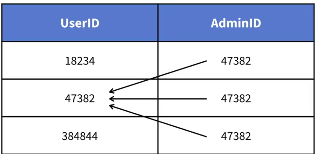

# Lesson Summary: Connecting User and Admin Data

## Overview

In this lesson, we explore the process of generating a report that lists each user and their associated admin from a database. While it may seem straightforward to export the admin IDs for each user, it is important to consider the needs of higher-level stakeholders who may not interpret data in terms of IDs.

## Key Points

- **Data Context**: The user and admin data are both stored in the `users` table. Each user has an associated `admin ID` which is also a `user ID` because all admins are users.
  

- **Problem Statement**: Exporting the admin ID alone is not helpful to higher-level stakeholders who do not work with IDs. Instead, they require more understandable information, such as user names or emails.

- **Solution**: To make the data more useful, convert the `admin IDs` into recognizable names. This involves:
  1. Matching each user's `admin ID` back to a `user ID`.
  2. Pulling the corresponding admin name for each user.

- **Approach**:
  - **Match User IDs to Admin IDs**: Since admin IDs are also user IDs, we can match each user's `admin ID` with a `user ID` in the same table.
  - **Retrieve Admin Names**: After matching, retrieve the admin names to create a comprehensive report.

## Steps to Implement

1. **Identify Data**: Ensure that both user IDs and admin IDs are available in the `users` table.
2. **Match IDs**: Create a join or query that matches each user's `admin ID` to a `user ID`.
3. **Pull Names**: Extract the admin names from the matched `user IDs` to include in the final report.

## Conclusion

By thinking from the end-user's perspective and transforming IDs into meaningful names, one can deliver more actionable and
